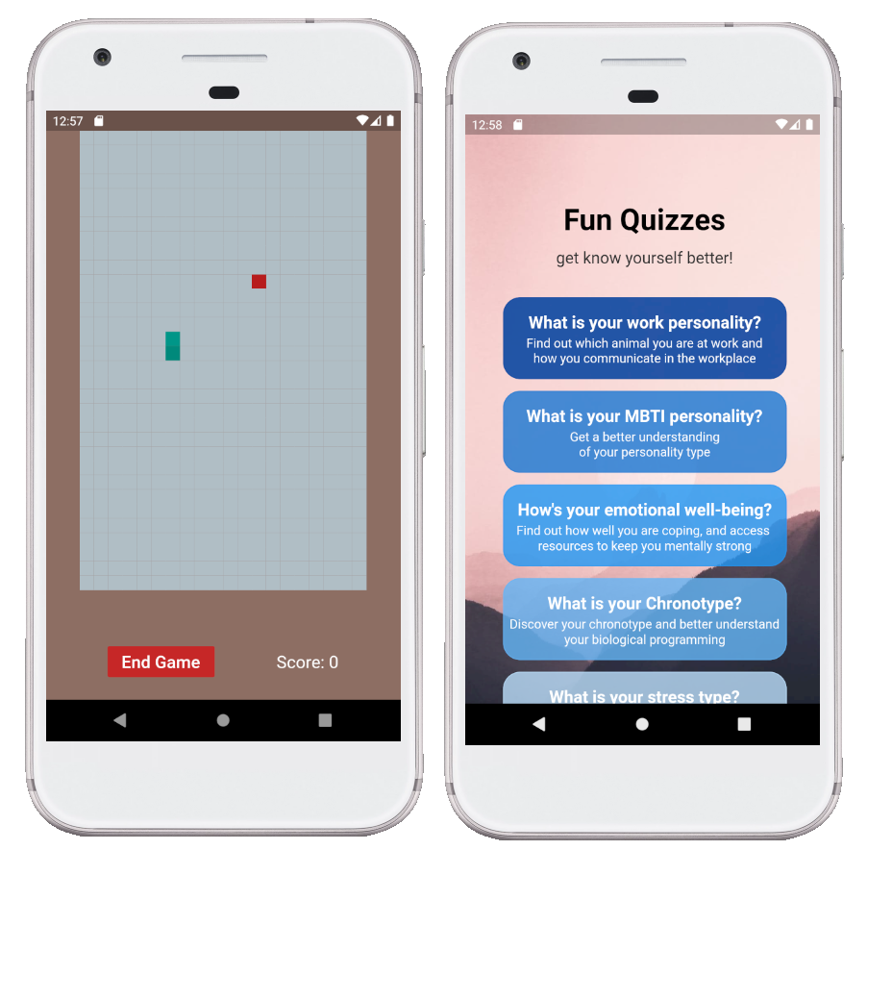

# Luman

**Lawyers are humans too** :(

## Members

- Jun Han
- Boon Khang
- Alvin
- Jolene
- Min Hui

## Functions (EDIT)

- Forums to post questions/connect
- Chatbot to direct them to different tools within the app
- Chatbot that is annoyomous (chatting with other users)
- Resources ?
- Stories of past lawyers (reduce stigma of lawyers with mental health)
- About us page (like this this is about)

## Topic of choice

> Psychological Risks: Telecommuting has blurred the line between work and home,
> and this is exacerbated by an increasingly prevalent "always-on" culture coupled
> with the accessibility availed by modern technology.
> While circuit breaker and social distancing regulations have proven effective in
> reducing the spread of COVID-19, the measures put in place could also contribute to
> psychological and interpersonal risks that extend beyond the obvious health and
> economic repercussions of the COVID-19 pandemic. Even if an individual has the
> good fortune of remaining healthy and financially stable during this period, he/she
> could still be vulnerable to stress, anxiety and interpersonal tension and conflict.
>
> With hybrid / remote working fast becoming the norm, how might we mitigate these
> psychological risks? (By Dentons Rodyk)

## Home Page

## SETUP

File => Preferences => Settings

Search for "Flutter run additional args"

then click Add Item

now type --no-sound-null-safety
