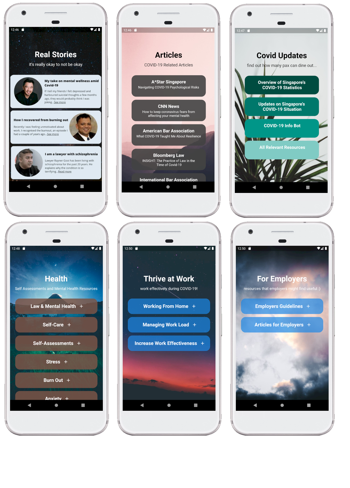
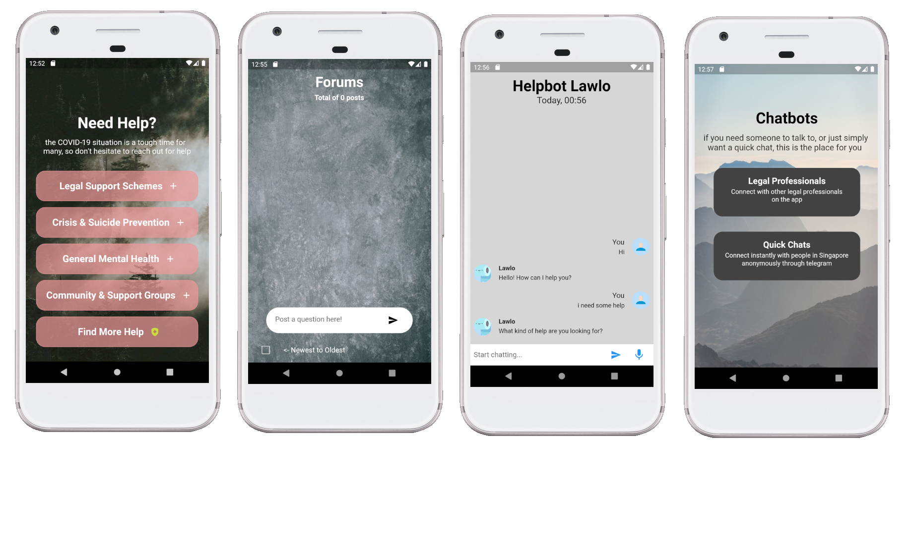

# Luman

Lawyers are humans too :(

## What am i?

A Flutter App developed using Google cloud services such as Firebase Auth, Firebase Realtime Database and Dialogflow.

## Description

Luman is a legal professionals-specific mental health app that is a a "one-stop shop" for legal professionals to assess COVID-19 information and mental health resources geared just for them, stay socially connected through various tools and be guided to the appropriate channels for help. Luman directs users to 100% free trusted resources and allows all users to remain anonymous (or not), empowering legal professionals to take care of their holistic well-being without having to feel embarrassed or ashamed that they are seeking help.

Luman features 3 main areas to mitigate the psychological risk of COVID-19: resources, connectivity tools and stress relievers.

## Features

- Login/Logout Authentication 
- Sign up function for new users
- Customizable usernames to provide anonymity
- Real time forum that allows users to post/edit/delete questions and reply to threads
- Chatbot (Lawlo) to interact with users
- Provide ample resources on various topics
- Includes a simple Snake game

## Topic of choice

> Psychological Risks: Telecommuting has blurred the line between work and home,
> and this is exacerbated by an increasingly prevalent "always-on" culture coupled
> with the accessibility availed by modern technology.
> While circuit breaker and social distancing regulations have proven effective in
> reducing the spread of COVID-19, the measures put in place could also contribute to
> psychological and interpersonal risks that extend beyond the obvious health and
> economic repercussions of the COVID-19 pandemic. Even if an individual has the
> good fortune of remaining healthy and financially stable during this period, he/she
> could still be vulnerable to stress, anxiety and interpersonal tension and conflict.
>
> With hybrid / remote working fast becoming the norm, how might we mitigate these
> psychological risks? (By Dentons Rodyk)

## Home Page

## SETUP

File => Preferences => Settings

Search for "Flutter run additional args"

then click Add Item

now type --no-sound-null-safety
